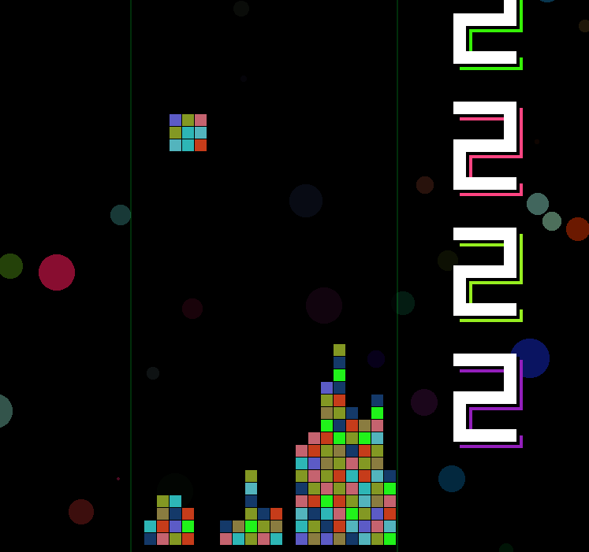
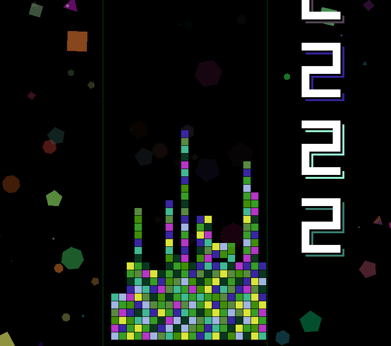

# 2D_Falling_Blocks
First attempt at a layout for a 2D falling block game in Go. Basically working, will detect and remove 2/3/4 similar color blocks horizontal & vertical. 
Arrow keys left and right move the falling block.

  

